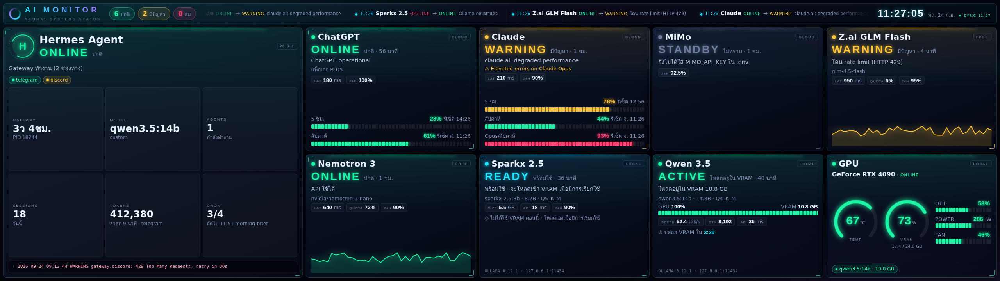

# AI Monitor

Dashboard สำหรับดูสถานะ AI ทุกตัว + Status Card ของ Hermes Agent ออกแบบให้แสดงค้างไว้บนจอ **Corsair Xeneon Edge (2560×720)**



| กลุ่ม | ตัว | วิธีเช็ค (ไม่เสีย token) |
|------|-----|---------------------------|
| Agent | Hermes Agent | อ่านไฟล์ใน `%LOCALAPPDATA%\hermes` แบบอ่านอย่างเดียว: gateway, ช่องทาง, model, sessions, cron, error |
| Cloud | ChatGPT, Claude | status page ทางการ + **แถบโควตา 5 ชม. / สัปดาห์** จากการล็อกอินของ Codex CLI / Claude Code |
| Cloud / Free | MiMo, Z.ai GLM Flash, Nemotron 3 | `GET /models` ด้วย API key ใน `.env` แล้วหาชื่อโมเดลจาก `model_hint` ให้อัตโนมัติ |
| Local | Sparkx 2.5, Qwen 3.5 | Ollama: **ACTIVE** (โหลดอยู่: VRAM, สัดส่วน GPU/CPU, tokens/sec, เวลาที่จะปล่อย VRAM) · **READY** (ติดตั้งแล้ว ยังไม่โหลด = ปกติ) · **MISSING** (ชื่อไม่ตรง แสดงรายชื่อโมเดลที่มี) · **OFFLINE** (Ollama ไม่ได้รัน) |
| Local | GPU (NVIDIA) | `nvidia-smi` ทุก 10 วินาที: อุณหภูมิ, VRAM, Utilization, Power, Fan + โมเดลไหนโหลดอยู่ใน VRAM |

**UX บนจอ Xeneon Edge (ทัชสกรีน)**
- แตะการ์ดใดก็ได้ → เปิดรายละเอียดเต็ม (ข้อความไม่ถูกตัด, เวลาเช็คล่าสุด, uptime, กราฟย้อนหลัง) แตะอีกครั้งหรือรอ 20 วินาทีจะปิดเอง
- แถบบนสุด: สรุปจำนวน ปกติ/มีปัญหา/ล่ม + ตัววิ่งแสดงเหตุการณ์ล่าสุด + นาฬิกา + ไฟ SYNC (ขึ้น LINK LOST ถ้าโปรแกรมหลังบ้านหยุด)
- การ์ดที่ข้อมูลไม่อัปเดตนานเกิน 3 รอบ จะจางลงและขึ้นป้าย "ข้อมูลเก่า"
- 23:00–07:00 หน้าจอหรี่ลงอัตโนมัติ, ถ้าเปิด "ลดภาพเคลื่อนไหว" ใน Windows แอนิเมชันจะหยุด

สี: 🟢 ปกติ · 🟡 มีปัญหา/ช้า/rate limit · 🔴 ล่ม (ต้องล้ม 2 ครั้งติดกัน การ์ดจะกะพริบ) · ⚪ ไม่ทราบ

## ติดตั้งบน Windows (คำสั่งเดียว)

เปิด **PowerShell** (ไม่ต้อง Run as admin) แล้ววาง:

```powershell
irm https://raw.githubusercontent.com/rattapoompradit/rattapoompradit/claude/hopeful-faraday-7c9bsw/ai-monitor/install.ps1 | iex
```

ตัวติดตั้งจะ:
1. ติดตั้ง Python 3.12 ให้ถ้ายังไม่มี (ผ่าน winget)
2. ดาวน์โหลดโปรแกรมไปไว้ที่ `%USERPROFILE%\ai-monitor` (ติดตั้งซ้ำเพื่ออัปเดตได้ โดย `.env` และ `config.yaml` ของคุณจะไม่ถูกทับ)
3. ติดตั้ง package, สร้าง `.env`
4. หาจอ Xeneon Edge (จอ 32:9) แล้วตั้งตำแหน่งใน `run.bat` ให้เอง
5. ตรวจเครื่อง: GPU (`nvidia-smi`), รายชื่อโมเดลใน Ollama, โฟลเดอร์ Hermes, การล็อกอิน Claude Code / Codex, API key ใน `.env` แล้วบอกว่าอะไรยังขาด
6. ถามว่าจะให้เปิดเองตอนเปิดเครื่องไหม แล้วเปิดโปรแกรมให้เลย

หลังติดตั้ง:
- ใส่ API key ใน `%USERPROFILE%\ai-monitor\.env`
- แก้ `model_hint` ของ Sparkx / Qwen ใน `config.yaml` ให้ตรงกับชื่อที่ตัวติดตั้งแสดง (จาก Ollama)
- เปิดใหม่: ดับเบิลคลิก `run.bat` (ข้อมูลจริง) หรือ `run.bat --demo` (ข้อมูลสมมติ)
- ปิด: Alt+F4 ที่หน้าจอ และปิดหน้าต่าง "AI Monitor" ที่ย่ออยู่ใน taskbar

### แถบโควตา ChatGPT / Claude

ใช้การล็อกอิน subscription ที่มีอยู่แล้วในเครื่อง (อ่านอย่างเดียว ไม่ต่ออายุ token เอง และส่ง token ไปที่ผู้ให้บริการเจ้าของเท่านั้น)

- **Claude:** ติดตั้ง [Claude Code](https://claude.com/claude-code) แล้วรัน `claude` ล็อกอินด้วยบัญชี Pro/Max (อ่านจาก `%USERPROFILE%\.claude\.credentials.json`)
- **ChatGPT:** ติดตั้ง Codex CLI (`npm i -g @openai/codex`) แล้วรัน `codex login` ด้วยบัญชี ChatGPT (อ่านจาก `%USERPROFILE%\.codex\auth.json`)
- ถ้าขึ้นว่า token หมดอายุ ให้เปิด Claude Code / Codex สักครั้ง
- endpoint ที่ใช้ไม่ใช่ API ทางการ ถ้าผู้ให้บริการเปลี่ยน แถบจะขึ้นข้อความ error แทน (ส่วนสถานะยังทำงาน) ไม่อยากใช้ให้ลบบรรทัด `usage:` ใน `config.yaml`
- สีแถบ: เขียว < 70%, เหลือง 70–89%, แดง ≥ 90% และถ้าใช้หมด 100% การ์ดจะเป็น WARNING

### ให้ขึ้นบนจอ Xeneon Edge

`run.bat` เปิด Edge แบบ kiosk (เต็มจอ ปิดด้วย Alt+F4) ที่ตำแหน่ง `EDGE_X`, `EDGE_Y` (ตัวติดตั้งตั้งให้แล้ว)
ถ้าไปขึ้นผิดจอ ดูตำแหน่งจอใน **Settings → System → Display** (ถ้าวาง Xeneon Edge ไว้ใต้จอหลัก ปกติจะเป็น `0` กับความสูงของจอหลัก เช่น `1440`) แล้วแก้ 2 บรรทัดนี้ใน `run.bat`

เปิดอัตโนมัติตอนเปิดเครื่องแบบทำเอง: กด `Win+R` → `shell:startup` → สร้าง shortcut ไปที่ `run.bat`

## แก้ปัญหา

ดับเบิลคลิก **`check.bat`** จะเช็คทุกตัวครั้งเดียวแล้วแสดงสาเหตุ เช่น

```
[OK  ] Qwen 3.5         โหลดอยู่ใน VRAM 10.8 GB (35 ms)
[WARN] Sparkx 2.5       ไม่พบโมเดล 'spark' ใน Ollama (มี: qwen3.5:14b, sparkx-v2:8b)
[DOWN] GPU              nvidia-smi error: ...
```

- Local AI ขึ้น OFFLINE: เปิด Ollama ก่อน (ไอคอนที่ taskbar) ถ้าตั้ง `OLLAMA_HOST` ไว้ โปรแกรมจะใช้ค่านั้นเอง (`base_url: auto`)
- ขึ้น MISSING: แก้ `model_hint` ใน `config.yaml` ให้เป็นคำที่อยู่ในชื่อโมเดลตามที่การ์ดแสดง

## ปรับแต่ง

ทุกอย่างอยู่ใน `config.yaml`: รอบเช็ค, timeout, เกณฑ์ความช้า, path ของ Hermes, `gateway_required`, เกณฑ์อุณหภูมิ GPU (`temp_warn_c` / `temp_crit_c`), `probe: true` (ยิง prompt จริง 1 token ทุก 30 นาทีเพื่อวัด latency จริง)

## พัฒนา

```bash
pip install -r requirements.txt pytest
python -m pytest
python -m ai_monitor --demo   # http://127.0.0.1:8765
```
